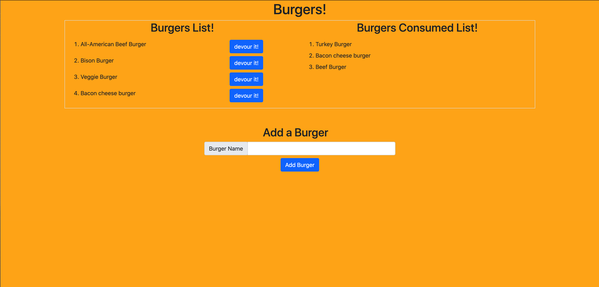

# Burger-log

## Description
  This app will help keep track burgers you logged and had in the past. 

  ---

## Preview: 

---
  ## Table of Contents
* [Installation](#installation)
* [License](#license)
* [Contributions](#contributions)
* [Tests](#tests)
* [Questions](#questions)

---
## Installation
Bring this repo to local machine. Run it on Visual Studio Code and open a terminal. Next step is to run "npm install 'mysql', 'express' & 'express-handlebars' " in the terminal. Once that is installed, run "node npm start". Follow the prompts or open a browser to localhost:8080 to see the site or view the live site. 

---
## License

Copyright 2021
Permission is hereby granted, free of charge, to any person obtaining a copy of this software and associated documentation files (the "Software"), to deal in the Software without restriction, including without limitation the rights to use, copy, modify, merge, publish, distribute, sublicense, and/or sell copies of the Software, and to permit persons to whom the Software is furnished to do so, subject to the following conditions:
The above copyright notice and this permission notice shall be included in all copies or substantial portions of the Software.
THE SOFTWARE IS PROVIDED "AS IS", WITHOUT WARRANTY OF ANY KIND, EXPRESS OR IMPLIED, INCLUDING BUT NOT LIMITED TO THE WARRANTIES OF MERCHANTABILITY, FITNESS FOR A PARTICULAR PURPOSE AND NONINFRINGEMENT. IN NO EVENT SHALL THE AUTHORS OR COPYRIGHT HOLDERS BE LIABLE FOR ANY CLAIM, DAMAGES OR OTHER LIABILITY, WHETHER IN AN ACTION OF CONTRACT, TORT OR OTHERWISE, ARISING FROM, OUT OF OR IN CONNECTION WITH THE SOFTWARE OR THE USE OR OTHER DEALINGS IN THE SOFTWARE.

---
## Contributions
Special thanks to Georgia Tech Boot-camp staff for the positive feedback and support. 
I would like to thank my classmates for assisting me whenever I reach out to them on slack. 

---

## Badges

---

## Tests
Once you follow the installation guide, you will be able to see the function of the app. Please follow installation guide or check out the live website.  

---

Please check out the my GitHub and the REPO to my project. 

[GitHub](http://github.com/spatel134)

---
[Burger-log](https://burgers-log-app.herokuapp.com/)! 

 *Please use Google Chrome browser*